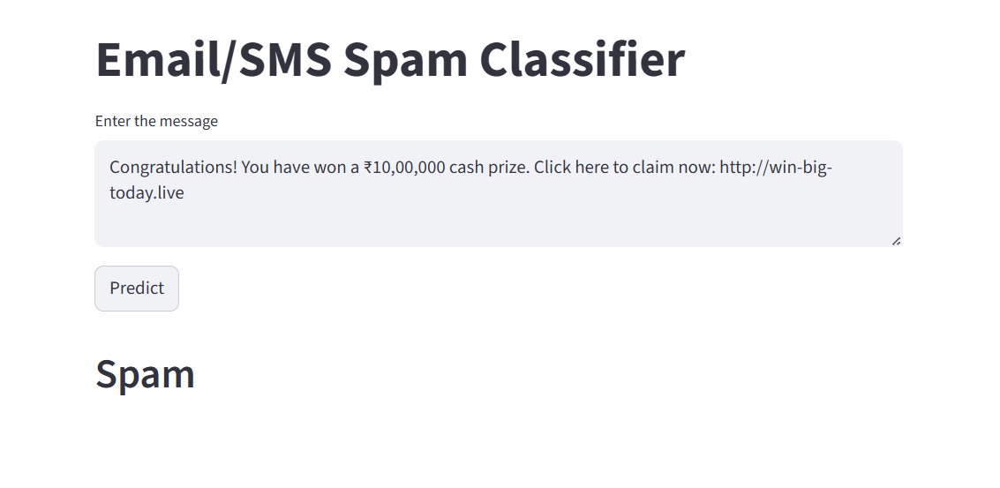
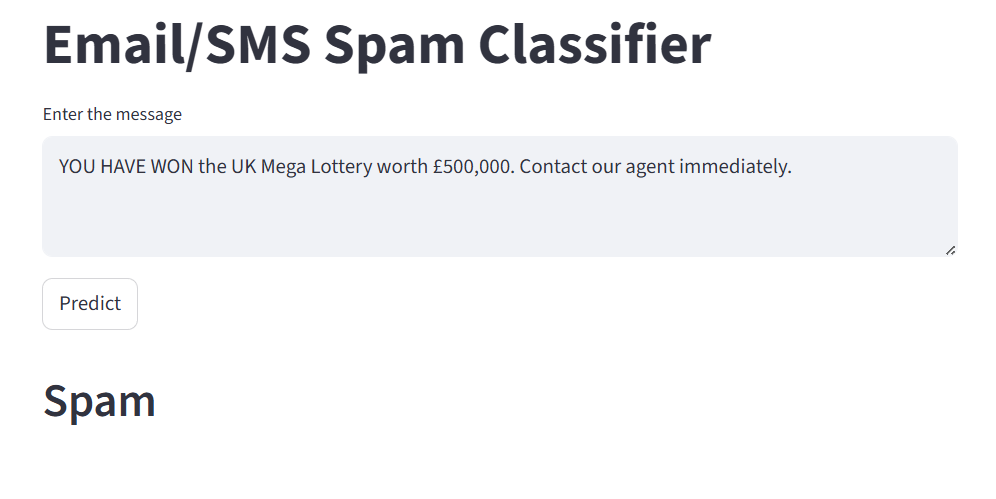
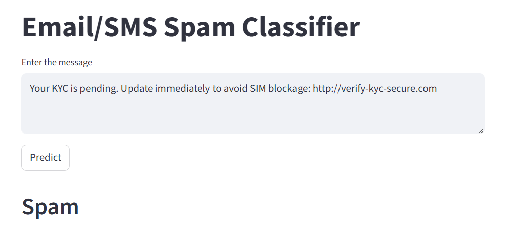
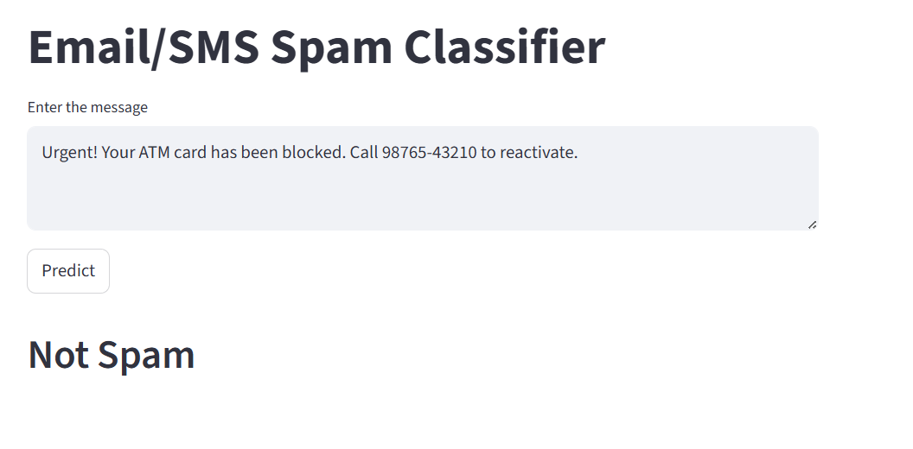
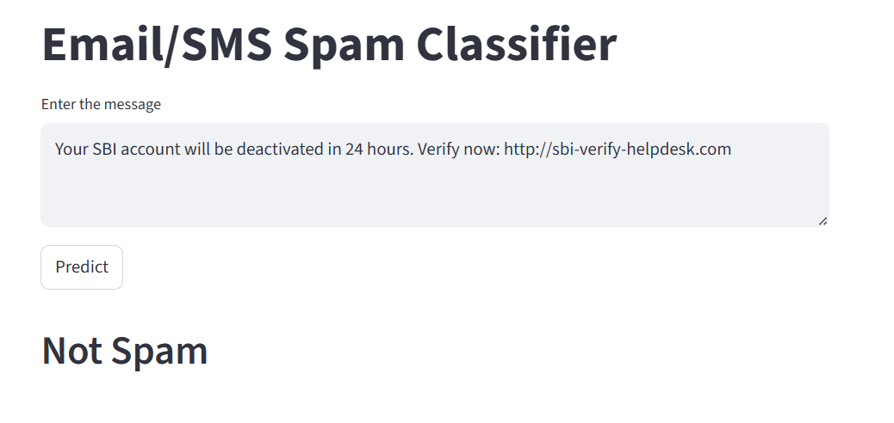
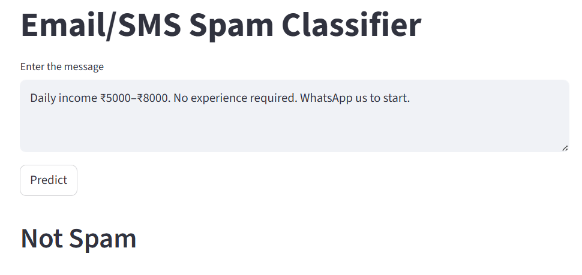

# 📧 SMS Spam Classifier

*A Machine Learning–powered text classification system deployed with Streamlit*

---
Try the deployed app here: **[Spam Classifier Web App](https://sms-spam-classifier-atmajo.streamlit.app/)**  

## 🚀 Overview

This project implements an end-to-end **SMS Spam Classification** system using traditional Machine Learning techniques. We trained multiple models on the popular **Kaggle SMS Spam Collection Dataset**, performed a detailed exploratory data analysis (EDA), optimized text vectorization approaches, and finally deployed the best-performing classifier as an interactive **Streamlit web application**.

The goal of the project is to automatically distinguish between **ham (legitimate)** and **spam (unwanted promotional)** messages with high accuracy and robustness.

---

## 📂 Dataset

We used the **SMS Spam Collection Dataset** from Kaggle, which contains:

* **5572 SMS messages**
* Labels:

  * **ham** → legitimate message
  * **spam** → unsolicited / promotional message

---

## 🧹 Data Cleaning & Preprocessing

Before model training, the dataset was thoroughly cleaned using standard NLP preprocessing steps:

* Lowercasing text
* Removing punctuation
* Removing stopwords
* Tokenization
* Stemming using Porter Stemmer
* Creating additional engineered features:

  * `char_count`
  * `word_count`
  * `sentence_count`

This preprocessing ensured the text was standardized and noise-free, allowing models to learn meaningful patterns.

---

## 📊 Exploratory Data Analysis (EDA)

We analyzed the dataset to understand structural differences between ham and spam messages. Key insights:

* **Spam messages are generally longer** in terms of characters, words, and sentences.
* Word count and character count show a strong positive correlation.
* Spam messages tend to have more structured, paragraph-like content.
* Ham messages exhibit higher variance—some are extremely short, while others are unusually long.
* Length-based features provide useful separability but are not sufficient alone; textual patterns are essential.

EDA plots included:

* Histograms of character/word distributions
* Pairplots showing correlations between engineered features
* Target distributions

These analyses informed our modeling decisions and validated the importance of TF-IDF features.

---

## 🔡 Feature Extraction

We experimented with:

* **CountVectorizer**
* **Default TF-IDF Vectorizer**
* **TF-IDF with `max_features = 3000`**

After comparative evaluation, **TF-IDF with 3000 features consistently provided the best performance**, balancing vocabulary richness with model generalization.

---

## 🤖 Model Training & Evaluation

Multiple Machine Learning algorithms were trained and compared:

| Algorithm                                    | Observations                                                                        |
| -------------------------------------------- | ----------------------------------------------------------------------------------- |
| **Multinomial Naive Bayes (MNB)**            | Consistently top-performing, excellent precision, ideal for sparse TF-IDF matrices. |
| **Bernoulli Naive Bayes (BNB)**              | Performed well but inferior to MNB on text data.                                    |
| **Complement Naive Bayes (CNB)**             | Strong performance but slightly below MNB.                                          |
| **Random Forest Classifier**                 | High accuracy, but overfitting signs and slower inference.                          |
| **Extra Trees Classifier**                   | Very competitive, strong performer with excellent precision.                        |
| **Support Vector Classifier (SVC)**          | High accuracy, but more computationally heavy.                                      |
| **Logistic Regression**                      | Solid baseline, stable and reliable across folds.                                   |
| **Gradient Boosting / XGBoost / AdaBoost**   | Good accuracy but weaker spam precision relative to Naive Bayes.                    |
| **Decision Tree / Bagging Classifier / KNN** | Lower precision or generalization issues compared to others.                        |

### 📌 Key Takeaways

* **Multinomial Naive Bayes (MNB)** achieved the best trade-off between accuracy, precision, generalization, and computational efficiency.
* Models using **TF-IDF (max_features = 3000)** consistently outperformed other vectorization settings.
* Precision was our key metric (minimizing false positives), and MNB delivered the strongest performance.

---

## 🏆 Final Model Selection

After evaluating all algorithms, **Multinomial Naive Bayes (MNB)** was selected as the final model due to:

* Highest precision among all candidates
* Best performance on TF-IDF features
* Fast training and inference
* Excellent handling of high-dimensional sparse data

---

## 🌐 Deployment with Streamlit

The final pipeline—including preprocessing, vectorization, and classification—was integrated into a **Streamlit app**.

Features of the deployed app:

* Clean and interactive UI
* Real-time spam prediction on user-entered SMS text
* Automatic preprocessing before model inference
* Instant classification results
* Hosted seamlessly using Streamlit Cloud

This deployment makes the model easily accessible and usable even by non-technical users.

---
### ⭐ Strengths

The model achieves high accuracy and excellent precision, especially with TF-IDF (3000 features) and Multinomial Naive Bayes.  
It generalizes well to promotional and lottery-type spam, detects malicious URLs effectively, runs extremely fast, and is lightweight enough for real-time Streamlit deployment.  
The preprocessing pipeline ensures clean, standardized inputs.

  
  
  

### ⚠️ Weaknesses

The model struggles with short phishing messages, urgent bank/KYC scams, and modern fraud patterns not present in the dataset.  
It lacks semantic understanding, relies on word frequency rather than meaning, and may miss intent-based spam.  
URL patterns, phone numbers, and paraphrased threats are also not handled well.

#### Examples of Misclassified Spam:

  
  
  

---

  Made with ❤️ using <strong>Python, Scikit-learn, NLTK, and Streamlit</strong>

